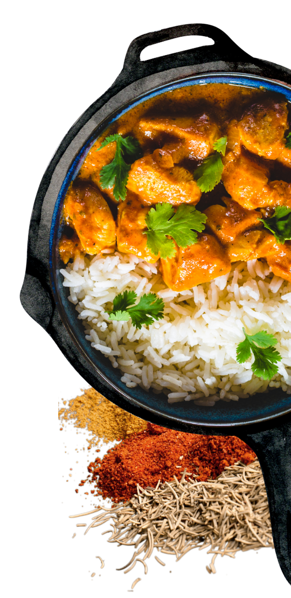

# 🍔 Foodies - The Future of Culinary Exploration

**Foodies** is not just a recipe app; it's an immersive culinary companion. Built with a focus on high-fidelity user experience, it blends AI-powered voice commands with stunning motion design to make cooking an interactive journey.

## 🌟 Premium Experience

- **🎙️ Voice-Activated Cooking**: Hands-free recipe navigation using AI Speech-to-Text and TTS. No more messy screens while cooking!
- **✨ Immersive Motion Design**: Powered by **Rive** and **Lottie** for smooth, interactive micro-animations.
- **📱 Fluid UI/UX**: Featuring custom **Iconsax** sets, elegant notifications, and liquid progress indicators.
- **🎧 Sensory Feedback**: High-quality audio feedback and music integration for a complete kitchen vibe.
- **🚀 High Performance**: Offline-first architecture using **Hive NoSQL** for lightning-fast data access.

## 🛠️ Built With

- **Framework**: Flutter (Cross-platform)
- **Animations**: Rive, Lottie, Flutter Animate
- **AI Integration**: Speech-to-Text, Voice recognition
- **Data**: Hive NoSQL, Shared Preferences
- **Communication**: Dio for high-performance API calls
- **Social**: Integrated social sharing and interactive confetti celebrations

## 📸 Interface Preview

  

  
  
  

## 🚀 Vision
To redefine how people interact with recipes, moving away from static text to a dynamic, voice-led, and visually stunning interactive experience.

---
Crafted with ❤️ and code by [Sachin Sharma](https://github.com/maisachinsharmahu)
